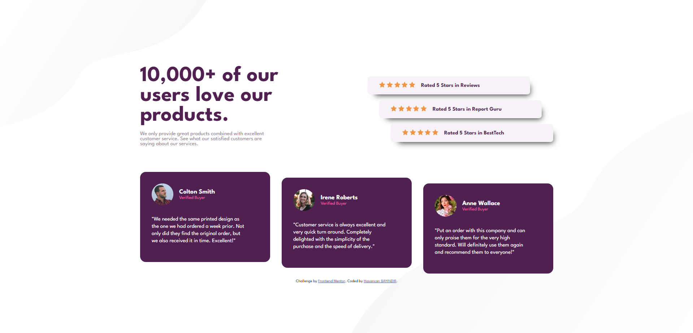

# Frontend Mentor - Social proof section



## My process

### Built with

- Semantic HTML5 markup
- CSS custom properties
- Flexbox
- Mobile-first workflow

### What I learned

I have learned how to position different piece of same container, mobile first design with media queries, root variable basics and flexbox. 

```html
<h1>Some CSS code I'm proud of</h1>
```
```css
.container .stats {
    display: flex;
    flex-direction: column;
    flex-wrap: wrap;
    justify-content: flex-start;
}


.stats .rating {
    width: 450px;
    height: 50px;
    border-radius: 0.5rem;
    background-color: var(--LightGrayishMagenta);
    border: none;
    display: flex;
    flex-wrap: wrap;
    justify-content: flex-start;
    align-items: center;
    column-gap: 1rem;
    margin-top: 1rem;
    padding-left: 2rem;
}

.rating p {
    color: var(--VeryDarkMagenta);
    font-weight: bold;
}


.rating:nth-child(2) {
    margin-left: 2rem;
}

.rating:nth-child(3) {
    margin-left: 4rem;
}

```

### Useful resources

- [Box Shadow](https://www.cssmatic.com/box-shadow) - This helped me for fancy box shadows.


## Author

- Frontend Mentor - [bayindirhsncn](https://www.frontendmentor.io/profile/bayindirhsncn)

- LinkedIn - [hasancan-bayindir](https://www.linkedin.com/in/hasancan-bayindir/)